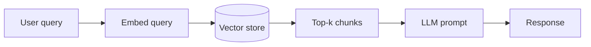
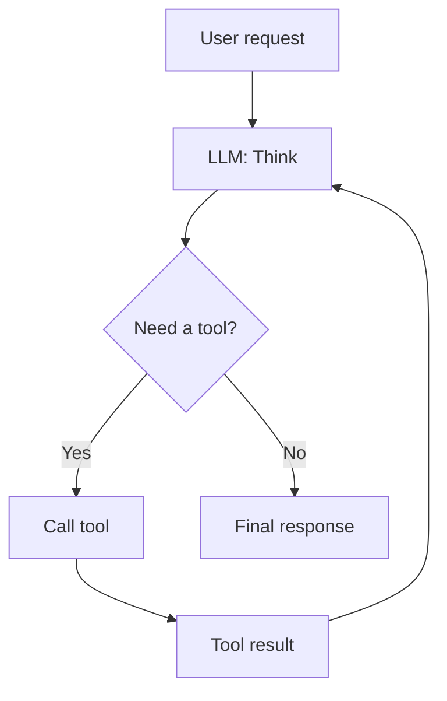
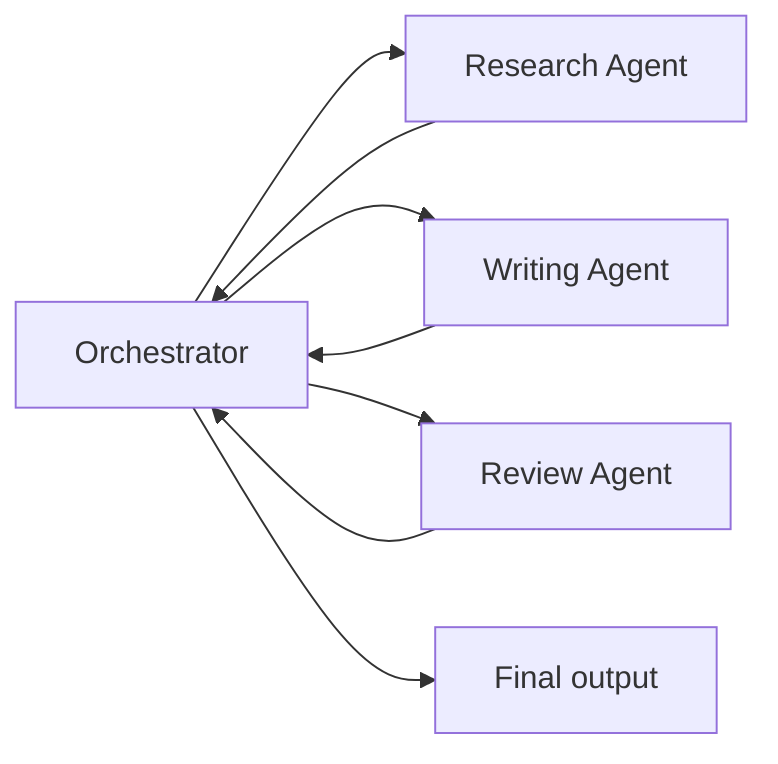

# Architecture Patterns

Common agentic AI patterns used in AI Innovation Lab projects. Use these as starting points — your Tech Lead will help you adapt them to your specific project.

---

## Core Patterns

### Retrieval-Augmented Generation (RAG)

The most common pattern in this lab. Ground your LLM's responses in real, up-to-date, client-specific data.



**When to use:** The client has a document corpus (policies, manuals, emails, tickets) that the AI needs to reason over.

**Key decisions:**
- **Embedding model:** `text-embedding-3-large` (OpenAI) for quality; `text-embedding-3-small` for cost
- **Vector store:** Pinecone (managed), Chroma (local/self-hosted), pgvector (PostgreSQL extension)
- **Chunk size:** 512–1024 tokens with 10–20% overlap is a reasonable starting point
- **Retrieval:** Dense retrieval (embedding similarity) works well; hybrid (dense + BM25) helps with keyword-heavy queries

**Common failure modes:**
- Retrieved chunks are too large — model loses focus
- No metadata filtering — retrieval returns chunks from irrelevant time periods or document types
- No re-ranking — top-k by embedding similarity alone misses semantically close but contextually wrong chunks

---

### Tool-Using Agent (ReAct Pattern)

An LLM that can call tools (functions, APIs, databases) and reason about the results before responding.



**When to use:** The task requires real-time data, multi-step actions, or integration with external systems.

**Key decisions:**
- **Tool definitions:** Be precise. Vague tool descriptions cause the model to call the wrong tool or misuse arguments.
- **Max iterations:** Set a hard cap (e.g., 10) to prevent infinite loops
- **Error handling:** Always return structured errors from tools — the LLM needs to reason about failures

---

### Multi-Agent Pipeline

Multiple specialized agents that hand off to each other. Useful when the task is complex enough that one agent can't do it well.



**When to use:** Distinct subtasks with different prompting strategies, or when you need one agent to check another's work.

**Key decisions:**
- **Orchestration:** N8N handles this well for no-code/low-code pipelines; LangGraph or CrewAI for code-first approaches
- **State management:** How does context pass between agents? Define your schema early.
- **Failure handling:** What happens when one agent returns an error or unexpected output? Define fallbacks.

---

## Engineering Considerations

### Evaluation

Don't skip eval. You need to measure whether your tool is actually working.

| What to measure | How |
|---|---|
| Retrieval precision | Does the retrieved context actually contain the answer? |
| Generation faithfulness | Is the model's answer grounded in the retrieved context? |
| End-to-end accuracy | Do users get the right answer? |
| Latency | Time to first token; total response time |
| Cost | Tokens in + out × model price |

Start with a small hand-labeled eval set (20–50 examples). Automate it so you can run it every sprint.

---

### Prompt Engineering

Structure your system prompts consistently:

```
[Role and context]
You are a [role] helping [user type] with [task].

[Data and constraints]
You have access to: [tools/data]
You must not: [guardrails]

[Output format]
Respond in [format]. If you cannot answer, say [fallback].
```

Version your prompts in code (not in a UI). Treat prompt changes like code changes: test them, commit them, track their effect on your eval set.

---

### Cost & Latency

| Optimization | When to use |
|---|---|
| Smaller model (GPT-4o-mini, Claude Haiku) | First pass, classification, routing |
| Caching | Repeated queries with stable data |
| Streaming | Better UX for long responses |
| Async calls | When multiple tools can run in parallel |
| Chunk size tuning | Reducing unnecessary tokens in context |

---

### Security & Data Handling

- **Never commit API keys.** Use environment variables. See your `.gitignore`.
- **Classify your data before building.** Ask your Tech Lead and stakeholder what risk level applies.
- **Log what you send to the LLM.** You need to know if client data is leaking into prompts it shouldn't be in.
- **Rate limiting.** Add it from the start — not after your stakeholder's users hit the API 10,000 times on Demo Day.

---

## Starter Repos

*(Links will be added by the Tech Lead team as approved starter templates are published to the `cu-aaii` org.)*

- [ ] RAG starter (LiteLLM + Chroma)
- [ ] N8N workflow export — basic RAG pipeline
- [ ] N8N workflow export — multi-agent with human-in-the-loop
- [ ] FastAPI + React scaffold for tool deployment
